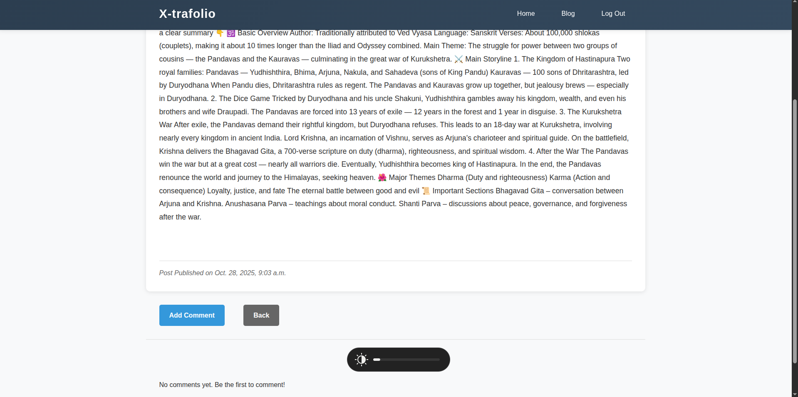

# X-trafolio

## 📘 Description
This web application named as X-trafolio, is based on python's Django framework. In this blog there are two type of user: Super user(staff) & Normal user. I have use `FBV`.

## 🚀 Features
- User register, login & logout
- User
  - Super user
    - Create Blog Post
    - Edit & Delete Blog Post
    - Add, Edit & Delete Comment
    - Upload Images, Videos & Attachments
  - Normal user
    - Add, Edit & Delete Comment
  

## ⚙️ Installation
Follow the steps below to set up the project locally on your machine

### 🧩 Prerequisites
Before you begin, ensure you have the following installed:

- **Python** 3.10 or higher
- **pip** (python package manager)
- **virtualenv** (optional but recommended)
- **Git**
- (Optional) **PostgreSQL** or any other databse you plan to use
  
*`Note`* ⚠️:- `For this project I have used the default database:` **`SQLite`**

### 🪜 Step 1: Clone the Repository
Clone the project from GitHub using the following command:

    git clone https://github.com/oye-san7osh/x-trablog.git

    cd myblog

### 🧱 Step 2: Create and Activate a Virtual Environment
It's best practice to use a virtual environment to isolate dependencies.

**On Window:**

    python -m venv venv
    venv\Scripts\activate

**On macOS/Linux:**

    python3 -m venv venv
    source venv/bin/activate

### 📦 Step 3: Install Dependencies
Once the virtual environment is activated, install the required Python packages:

    pip3 install -r requirements.txt
        
If you don't have a `requirements.txt` file yet, you can create one using:

    pip3 freeze > requirements.txt

### 🗄️ Step 4: Apply Database Migrations
Run the following commands to create the necessary database tables:

    python3 manage.py makemigrations
    python3 manage.py migrate

### 🚀 Step 5: Run the Development Server
Finally start the Django development server:
     
     python3 manage.py runserver

You can now visit your project in the browser at:

    http://127.0.0.1:8000/

**In Short:**

    git clone https://github.com/oye-san7osh/x-trablog.git

    cd myblog
    python3 -m venv venv

    source venv/bin/activate
    pip3 install -r requirements.txt

    python3 manage.py makemigrations
    python3 manage.py migrate

    python3 manage.py runserver

## Project Demo[images]

1. Home:
    

2. Register:
    

3. Login:
    

4. Logout:
    

5. Blog ( edit and delete ):
    

6. Blog
    

7. Create Blog:
    

8. Post Detail:
    

9. Update Post:
    

10. Comment Page:
    

11. Edit and Delete Comment:
    

12. Delete Post:
    
  

